# Game Architecture Diagrams

## Diagram 1: Game World & Player Experience

```mermaid
graph TB
    %% World Layer
    subgraph World["🗺️ Infinite Hex World"]
        Hex1["Hex (2,147,483,647, 2,147,483,647)<br/>🏔️ Mountain Biome"]
        Hex2["Hex (2,147,483,648, 2,147,483,647)<br/>🌲 Forest Biome"]
        Hex3["Hex (2,147,483,647, 2,147,483,648)<br/>🏜️ Desert Biome"]
        Hex4["Hex (2,147,483,649, 2,147,483,647)<br/>🌿 Swamp Biome"]
    end

    %% Discovery & Areas
    subgraph Discovery["🔍 Area Discovery"]
        Area1["Mining Area #1<br/>⛏️ Iron Vein<br/>⛏️ Gold Vein"]
        Area2["Harvest Area #1<br/>🌱 Sacred Grove<br/>🍄 Mushroom Patch"]
        Area3["Ancient Ruins #1<br/>🏛️ Mystical Forge<br/>💎 Crystal Cache"]
        Area4["Resource Cache #1<br/>📦 Buried Supplies"]
    end

    %% NFT Ownership
    subgraph NFTSystem["🏆 NFT Ownership System"]
        NFT1["Area NFT #001<br/>👤 Owner: Alice<br/>💰 Revenue: 1,250 gold<br/>📍 Discovery Block: 15,432"]
        NFT2["Area NFT #002<br/>👤 Owner: Bob<br/>💰 Revenue: 890 gold<br/>📍 Discovery Block: 15,987"]
        NFT3["Area NFT #003<br/>👤 Owner: Charlie<br/>💰 Revenue: 2,100 gold<br/>📍 Discovery Block: 16,234"]
        NFT4["Area NFT #004<br/>👤 Owner: Dana<br/>💰 Revenue: 340 gold<br/>📍 Discovery Block: 16,445"]
    end

    %% Game Modules
    subgraph Modules["🎮 Game Modules"]
        MiningMod["⛏️ Mining Module<br/>• start_mining<br/>• collect_ore<br/>• check_stability"]
        HarvestMod["🌾 Harvesting Module<br/>• harvest_plant<br/>• explore_area<br/>• tend_garden"]
        CraftingMod["🔨 Crafting Module<br/>• craft_combination<br/>• smelt_ore<br/>• enchant_item"]
        FutureMod["🚀 Future Modules<br/>• Combat Module<br/>• Social Module<br/>• Housing Module"]
    end

    %% Action Framework
    subgraph ActionSys["⚙️ Action Framework"]
        ActionDispatcher["🎯 Action Dispatcher<br/>• Validates modules<br/>• Checks time locks<br/>• Runs permission hooks<br/>• Executes actions<br/>• Handles payments"]
        ModuleRegistry["📋 Module Registry<br/>• Register modules<br/>• Validate interfaces<br/>• Version control"]
    end

    %% Hook System
    subgraph HookSys["🪝 Hook System"]
        Hook1["💰 Revenue Hook<br/>👤 Owner: Alice<br/>💵 Fee: 50 gold per mining<br/>📊 Revenue Share: 20%"]
        Hook2["🎫 Membership Hook<br/>👤 Owner: Bob<br/>🎟️ NFT Required<br/>⏰ Daily Limits"]
        Hook3["🏛️ DAO Governance Hook<br/>👥 Guild: Mystic Order<br/>🗳️ Voting Required<br/>⚖️ Multi-sig Approval"]
        Hook4["📈 Dynamic Pricing Hook<br/>📊 Supply/Demand Based<br/>⚡ Real-time Adjustments"]
    end

    %% Player Actions
    subgraph Players["👥 Players & Adventurers"]
        Alice["👤 Alice<br/>🗡️ Adventurer #1<br/>⚡ Energy: 85/100<br/>🎒 Backpack: 15kg"]
        Bob["👤 Bob<br/>🗡️ Adventurer #2<br/>⚡ Energy: 72/100<br/>🎒 Backpack: 8kg"]
        Charlie["👤 Charlie<br/>🗡️ Adventurer #3<br/>⚡ Energy: 91/100<br/>🎒 Backpack: 22kg"]
    end

    %% Connections
    Hex1 --> Area1
    Hex2 --> Area2
    Hex3 --> Area3
    Hex4 --> Area4

    Area1 --> NFT1
    Area2 --> NFT2
    Area3 --> NFT3
    Area4 --> NFT4

    NFT1 --> Hook1
    NFT2 --> Hook2
    NFT3 --> Hook3
    NFT4 --> Hook4

    Alice --> ActionDispatcher
    Bob --> ActionDispatcher
    Charlie --> ActionDispatcher

    ActionDispatcher --> ModuleRegistry
    ActionDispatcher --> MiningMod
    ActionDispatcher --> HarvestMod
    ActionDispatcher --> CraftingMod

    ActionDispatcher --> Hook1
    ActionDispatcher --> Hook2
    ActionDispatcher --> Hook3
    ActionDispatcher --> Hook4

    Hook1 --> NFT1
    Hook2 --> NFT2
    Hook3 --> NFT3
    Hook4 --> NFT4

    %% Action Flow Example
    subgraph ActionFlow["🔄 Example Action Flow"]
        Step1["1. Alice wants to mine in Area #1"]
        Step2["2. ActionDispatcher checks NFT #001"]
        Step3["3. Revenue Hook #1 requires 50 gold"]
        Step4["4. Payment sent to Alice (owner)"]
        Step5["5. Mining Module executes action"]
        Step6["6. 20% revenue share to Alice"]
    end

    Step1 --> Step2 --> Step3 --> Step4 --> Step5 --> Step6

    %% Styling
    classDef worldClass fill:#e1f5fe,stroke:#01579b,stroke-width:2px
    classDef discoveryClass fill:#f3e5f5,stroke:#4a148c,stroke-width:2px
    classDef nftClass fill:#fff3e0,stroke:#e65100,stroke-width:2px
    classDef moduleClass fill:#e8f5e8,stroke:#2e7d32,stroke-width:2px
    classDef hookClass fill:#ffebee,stroke:#c62828,stroke-width:2px
    classDef playerClass fill:#e3f2fd,stroke:#1565c0,stroke-width:2px
    classDef actionClass fill:#fafafa,stroke:#424242,stroke-width:2px

    class Hex1,Hex2,Hex3,Hex4 worldClass
    class Area1,Area2,Area3,Area4 discoveryClass
    class NFT1,NFT2,NFT3,NFT4 nftClass
    class MiningMod,HarvestMod,CraftingMod,FutureMod moduleClass
    class Hook1,Hook2,Hook3,Hook4 hookClass
    class Alice,Bob,Charlie playerClass
    class ActionDispatcher,ModuleRegistry actionClass
```

## Diagram 2: Technical Architecture & Data Flow

```mermaid
graph TD
    %% Core Infrastructure
    subgraph CoreInfra["🏗️ Core Infrastructure"]
        ActionDispatcher["⚙️ Action Dispatcher<br/>Central coordinator for all actions"]
        ModuleRegistry["📋 Module Registry<br/>Dynamic module discovery"]
        AreaOwnershipNFT["🏆 Area Ownership NFT<br/>ERC-721 with revenue tracking"]
        ParameterUtils["🔧 Parameter Utils<br/>Type-safe parameter handling"]
    end

    %% Universal Interfaces
    subgraph Interfaces["🔌 Universal Interfaces"]
        IGameModule["📦 IGameModule<br/>• get_module_id()<br/>• get_supported_actions()<br/>• validate_action()<br/>• execute_action()"]
        IUniversalHook["🪝 IUniversalHook<br/>• before_action()<br/>• after_action()<br/>• before_value_transfer()<br/>• before_information_access()"]
    end

    %% Module Implementations
    subgraph ModuleImpls["📋 Module Implementations"]
        MiningModule["⛏️ Mining Module<br/>Implements IGameModule<br/>Actions: start_mining, collect_ore"]
        HarvestingModule["🌾 Harvesting Module<br/>Implements IGameModule<br/>Actions: harvest_plant, explore_area"]
        CraftingModule["🔨 Crafting Module<br/>Implements IGameModule<br/>Actions: craft_combination, smelt_ore"]
        NewModule["➕ Future Module<br/>Implements IGameModule<br/>Automatic hook compatibility"]
    end

    %% Hook Implementations
    subgraph HookImpls["🪝 Hook Implementations"]
        SimpleHook["💰 Simple Fee Hook<br/>Implements IUniversalHook<br/>Basic access fees"]
        GuildHook["🏛️ Guild Staking Hook<br/>Implements IUniversalHook<br/>Member-only access"]
        AuctionHook["🏺 Auction Slot Hook<br/>Implements IUniversalHook<br/>Time-based bidding"]
        CustomHook["🎨 Custom Hook<br/>Player-deployed contract<br/>Unlimited business logic"]
    end

    %% Data Storage
    subgraph Storage["💾 Data Storage"]
        ObjectControllers["object_controllers<br/>LegacyMap<felt252, felt252><br/>object_id → owner_address"]
        ObjectHooks["object_hooks<br/>LegacyMap<felt252, Array<felt252>><br/>object_id → [hook_addresses]"]
        RegisteredModules["registered_modules<br/>LegacyMap<felt252, felt252><br/>module_id → contract_address"]
        TimeLocks["active_time_locks<br/>LegacyMap<felt252, TimeLock><br/>actor_id → lock_info"]
        NFTData["token_area_data<br/>LegacyMap<u256, AreaOwnershipData><br/>token_id → area_info"]
    end

    %% Action Flow
    subgraph ActionFlow["🔄 Action Processing Flow"]
        Step1["📥 ActionRequest<br/>module_id, action_type<br/>actor_id, target_id<br/>parameters, context"]
        Step2["✅ Module Validation<br/>Check module exists<br/>Validate parameters<br/>Check energy/resources"]
        Step3["🔒 Permission Hooks<br/>Run hook chain<br/>Process payments<br/>Handle custom logic"]
        Step4["⚡ Action Execution<br/>Module executes action<br/>Update game state<br/>Emit events"]
        Step5["⏰ Post-Processing<br/>Apply time locks<br/>Run after_action hooks<br/>Distribute revenue"]
    end

    %% Connections - Core Infrastructure
    ActionDispatcher --> ModuleRegistry
    ActionDispatcher --> AreaOwnershipNFT
    ActionDispatcher --> ParameterUtils

    %% Connections - Interfaces
    IGameModule --> ModuleImpls
    IUniversalHook --> HookImpls

    %% Connections - Module Registration
    ModuleRegistry --> MiningModule
    ModuleRegistry --> HarvestingModule
    ModuleRegistry --> CraftingModule
    ModuleRegistry --> NewModule

    %% Connections - Hook System
    ActionDispatcher --> SimpleHook
    ActionDispatcher --> GuildHook
    ActionDispatcher --> AuctionHook
    ActionDispatcher --> CustomHook

    %% Connections - Data Storage
    ActionDispatcher --> Storage
    AreaOwnershipNFT --> NFTData

    %% Connections - Action Flow
    Step1 --> Step2 --> Step3 --> Step4 --> Step5

    ActionDispatcher --> Step1
    ModuleRegistry --> Step2
    ObjectHooks --> Step3
    ModuleImpls --> Step4
    TimeLocks --> Step5

    %% Revenue Flow
    subgraph RevenueFlow["💰 Revenue Flow"]
        UserPayment["👤 User Payment<br/>Gold/tokens paid"]
        HookRevenue["🪝 Hook Contract<br/>Collects fees"]
        AreaOwner["🏆 Area Owner<br/>NFT holder earnings"]
        RevenueDistribution["📊 Revenue Distribution<br/>Automatic via NFT contract"]
    end

    UserPayment --> HookRevenue --> RevenueDistribution --> AreaOwner
    RevenueDistribution --> AreaOwnershipNFT

    %% Discovery Flow
    subgraph DiscoveryFlow["🔍 Discovery Flow"]
        ExploreHex["🗺️ Explore Hex<br/>Player discovers area"]
        MintNFT["🏆 Mint NFT<br/>Area ownership created"]
        SetController["🔐 Set Controller<br/>Register in ActionDispatcher"]
        AttachHooks["🪝 Attach Hooks<br/>Owner sets business logic"]
    end

    ExploreHex --> MintNFT --> SetController --> AttachHooks
    MintNFT --> AreaOwnershipNFT
    SetController --> ObjectControllers
    AttachHooks --> ObjectHooks

    %% Styling
    classDef coreClass fill:#e3f2fd,stroke:#1565c0,stroke-width:3px
    classDef interfaceClass fill:#e8f5e8,stroke:#2e7d32,stroke-width:2px
    classDef moduleClass fill:#fff3e0,stroke:#ef6c00,stroke-width:2px
    classDef hookClass fill:#ffebee,stroke:#c62828,stroke-width:2px
    classDef storageClass fill:#f3e5f5,stroke:#7b1fa2,stroke-width:2px
    classDef flowClass fill:#fafafa,stroke:#424242,stroke-width:2px

    class ActionDispatcher,ModuleRegistry,AreaOwnershipNFT,ParameterUtils coreClass
    class IGameModule,IUniversalHook interfaceClass
    class MiningModule,HarvestingModule,CraftingModule,NewModule moduleClass
    class SimpleHook,GuildHook,AuctionHook,CustomHook hookClass
    class ObjectControllers,ObjectHooks,RegisteredModules,TimeLocks,NFTData storageClass
    class Step1,Step2,Step3,Step4,Step5,UserPayment,HookRevenue,AreaOwner,RevenueDistribution,ExploreHex,MintNFT,SetController,AttachHooks flowClass
```

## How to Use These Diagrams

### Rendering the Diagrams

These Mermaid diagrams can be rendered in:

1. **GitHub/GitLab**: Automatically renders in README files and markdown documents
2. **Mermaid Live Editor**: Copy the code to [mermaid.live](https://mermaid.live)
3. **VS Code**: Use the Mermaid Preview extension
4. **Documentation Sites**: Most support Mermaid rendering (Gitbook, Docusaurus, etc.)

### Diagram Purposes

**Diagram 1 (Game World & Player Experience)**:

- Use for explaining the game to players and investors
- Shows the complete player journey from exploration to revenue
- Demonstrates the interconnected ecosystem

**Diagram 2 (Technical Architecture & Data Flow)**:

- Use for technical documentation and developer onboarding
- Shows the clean separation of concerns
- Illustrates how new modules and hooks integrate seamlessly

These diagrams effectively communicate the revolutionary nature of your hook-based, discovery-driven economic architecture!
