# Infinite Hex Adventurers - Game Overview

## Vision: The World's First Programmable Economy Game

An **infinite, procedurally-generated hex grid** where exploration creates **property rights**, discovery generates **revenue**, and players and agents become **economic architects** programming their own business models into the game world.

At the center lies **Core** at coordinates (0,0), where all players begin their journey into the infinite unknown. But unlike any game before, **what you discover becomes truly yours** - and others must play by **your rules** to access it.

## The Revolutionary Ownership System

### Discovery = Property Rights

When you're the **first to discover** a mining vein, harvest area, or ancient ruin, you receive an **ownership NFT** that grants:

- **Exclusive control** over access rules and pricing
- **Automatic revenue** from all activity in your territory
- **Tradeable ownership** that appreciates with successful development
- **Complete customization** of how others can use your discoveries

```mermaid
graph LR
    A["🗺️ Explore<br/>Unknown Hex"] --> B["💎 Discover<br/>Mining Vein"]
    B --> C["🏆 Mint<br/>Ownership NFT"]
    C --> D["🪝 Deploy<br/>Business Logic"]
    D --> E["💰 Collect<br/>Revenue"]

    F["👥 Other Players"] --> G["💳 Pay Fees<br/>to Use Vein"]
    G --> E

    style A fill:#e1f5fe
    style B fill:#f3e5f5
    style C fill:#fff3e0
    style D fill:#ffebee
    style E fill:#e8f5e8
```

### Programmable Business Models

As an area owner, you don't just set simple fees. You can deploy **custom smart contracts** that create sophisticated business models:

**🏛️ Mining Cooperatives**: Members pool resources, share profits, vote on operations  
**🎫 Membership Clubs**: NFT-gated access with daily limits and exclusive perks  
**🏺 Auction Systems**: Time slots go to highest bidders, dynamic pricing  
**📈 Investment Vehicles**: Players buy shares in successful territories  
**🛡️ Insurance Services**: Cover losses from mine collapses and expeditions gone wrong

```mermaid
graph TB
    Player["👤 You<br/>Territory Owner"]

    subgraph BusinessModels["🏪 Your Business Models"]
        Fee["💰 Simple Fees<br/>50 gold per use"]
        Guild["🏛️ Mining Guild<br/>Members only"]
        Auction["🏺 Time Auctions<br/>Highest bidder"]
        Shares["📈 Investment Shares<br/>Profit sharing"]
    end

    subgraph Users["👥 Other Players"]
        Miner1["⛏️ Casual Miner"]
        Miner2["🏛️ Guild Member"]
        Miner3["💰 Rich Bidder"]
        Miner4["📊 Investor"]
    end

    Player --> BusinessModels
    Fee --> Miner1
    Guild --> Miner2
    Auction --> Miner3
    Shares --> Miner4

    Miner1 --> Revenue["💰 Your Revenue"]
    Miner2 --> Revenue
    Miner3 --> Revenue
    Miner4 --> Revenue

    style Player fill:#e3f2fd
    style Revenue fill:#e8f5e8
```

### Economic Warfare & Strategy

- **Sabotage competitors** by overcrowding their unstable mining operations
- **Corner markets** by controlling key resource types or trade routes
- **Build alliances** through profit-sharing agreements and territorial partnerships
- **Create monopolies** then charge premium prices for essential resources

## How You Play: Managing Autonomous Economic Agents

You don't control characters directly. Instead, you **manage a team of programmable Adventurers** who can act autonomously while building an **economic empire** through discovery and smart business model deployment.

### Your Adventurers Are Autonomous Agents

Each adventurer is a **programmable economic agent** with:

- **10 Core Traits**: Strength, Endurance, Agility, Vitality, Intelligence, Wisdom, Charisma, Survival, Craftsmanship, Leadership
- **Modular Specializations**: New skills unlock as game modules are discovered (mining efficiency, trading expertise, diplomatic relations)
- **Custom Behavior Programming**: Deploy smart contracts that define how they trade, cooperate, and interact with others
- **Autonomous Operation**: They work intelligently even when you're offline, building relationships and managing resources

```mermaid
graph TD
    You["👤 You<br/>Economic Architect"]

    subgraph Team["🤖 Your Autonomous Adventurer Team"]
        A1["🤖 Trading Bot<br/>💰 Profit optimization<br/>📊 Market analysis"]
        A2["🤖 Mining Coordinator<br/>⛏️ Group operations<br/>⚖️ Fair profit sharing"]
        A3["🤖 Resource Sharer<br/>🤝 Community member<br/>🏦 Favor banking"]
    end

    subgraph World["🗺️ Infinite World + Energy System"]
        H1["🏔️ Mountain Hex<br/>⚡ Energy Cost: 45/100 blocks<br/>📈 Productivity Tax: +180"]
        H2["🌲 Forest Hex<br/>⚡ Energy Cost: 35/100 blocks<br/>📈 Productivity Tax: +90"]
        H3["🏜️ Desert Hex<br/>⚡ Energy Cost: 55/100 blocks<br/>⚡ DECAY LEVEL: 85% - CLAIMABLE!"]
    end

    subgraph Empire["🏰 Your Economic Empire"]
        NFT1["🏆 Mining Rights<br/>💰 Revenue: 1,200 gold<br/>⚡ Maintenance: 225 energy"]
        NFT2["🏆 Harvest Rights<br/>💰 Revenue: 890 gold<br/>⚡ Maintenance: 125 energy"]
        NFT3["🏆 Ruin Access<br/>💰 Revenue: 2,100 gold<br/>🚨 UNDER THREAT - Defend or Lose!"]
    end

    You --> Team
    A1 --> H1
    A2 --> H2
    A3 --> H3

    H1 --> NFT1
    H2 --> NFT2
    H3 --> NFT3

    NFT1 --> You
    NFT2 --> You
    NFT3 --> You

    style You fill:#e3f2fd
    style NFT1 fill:#fff3e0
    style NFT2 fill:#fff3e0
    style NFT3 fill:#ffebee
    style H3 fill:#ffebee
```

### Programmable Adventurer Behaviors

Your adventurers can be programmed with sophisticated autonomous behaviors:

**🤖 Trading Bots**: Autonomous profit optimization, counter-offers, blacklist management, loyalty programs  
**⛏️ Mining Coordinators**: Group formation, safety protocols, fair profit sharing, risk assessment  
**🤝 Resource Sharers**: Community participation, favor banking, emergency mutual aid  
**🕵️ Information Brokers**: Intelligence gathering, data sales, reputation tracking  
**🏛️ Diplomatic Agents**: Mediation services, alliance formation, conflict resolution

### Character Development & Progression

- **Learning by Doing**: Skills improve through use - mining makes you a better miner
- **10 Core Traits**: Physical (Strength, Endurance, Agility, Vitality), Mental (Intelligence, Wisdom, Charisma), Specialized (Survival, Craftsmanship, Leadership)
- **Modular Specializations**: New traits unlock as game modules are discovered
- **Trait Synergies**: High craftsmanship + intelligence = innovation bonuses
- **Weight-limited backpacks** (10-30kg capacity depending on gear)
- **Adjacent-only movement** (no teleporting across the world)
- **True permadeath** - when they die, they're gone forever along with everything they carried

### Discovery & Development Process

1. **Explore adjacent hex** → Reveals biome type, potential for discovery
2. **Discover areas** → First discoverer gets ownership NFT and control rights
3. **Deploy business logic** → Set access rules, pricing, revenue sharing
4. **Develop territory** → Attract users, optimize operations, collect revenue
5. **Build empire** → Acquire more territories, form business partnerships

## Self-Regulating Economic System

### Territorial Decay & Energy Economics

Unlike traditional games where property is permanent, territories in Infinite Hex Adventurers require **constant energy investment** to remain functional:

**⚡ Energy Hunger**: Every owned hex consumes energy based on:

- **Base terrain difficulty** (swamps cost more than plains)
- **Productivity tax** (higher output = higher energy costs)
- **Distance from spawn** (remote territories cost more to maintain)
- **Infrastructure complexity** (advanced buildings increase coordination costs)

**📉 Territorial Decay**: Neglected territories progressively degrade:

- **0-20% Decay**: Minor efficiency penalties
- **21-50% Decay**: Slower operations, some services offline
- **51-80% Decay**: Most functions disabled, infrastructure failing
- **80-100% Decay**: **Territory becomes claimable by others!**

**🏴‍☠️ Hostile Takeovers**: When territories reach 80%+ decay, any player can claim them by investing sufficient energy to restore functionality. Original owners have a grace period to defend their territory, but if they can't maintain it, they lose it.

```mermaid
graph TD
    A["🏰 Productive Territory<br/>High Revenue Generation"] --> B["📈 Productivity Tax<br/>Higher Energy Costs"]
    B --> C["⚡ Energy Investment<br/>Required for Maintenance"]
    C --> D{"💰 Can Afford<br/>Maintenance?"}

    D -->|Yes| E["✅ Territory Maintained<br/>Continue Operations"]
    D -->|No| F["📉 Territory Decay<br/>Efficiency Decreases"]

    F --> G["🚨 80% Decay Reached<br/>Territory Becomes Claimable"]
    G --> H["⏰ Grace Period<br/>Original Owner Can Defend"]
    H --> I{"🛡️ Owner Defends<br/>with Energy?"}

    I -->|Yes| E
    I -->|No| J["🏴‍☠️ Hostile Takeover<br/>New Owner Claims Territory"]

    E --> A

    style A fill:#e8f5e8
    style G fill:#ffebee
    style J fill:#ffebee
```

This creates **natural territorial limits** - players can only maintain as many territories as they can supply with energy, preventing infinite expansion and ensuring active territorial management.

### Anti-Inflation Economics

**🔄 Universal Energy Conversion**: Any item can be converted back to energy, creating price floors and resource circulation  
**📊 Dynamic Market Response**: Conversion rates fluctuate based on supply/demand to prevent market manipulation  
**⚖️ Progressive Scaling**: Wealthy players face higher energy costs, preventing runaway accumulation  
**🌍 Healthy Turnover**: Inactive territories return to market availability through decay system

## The Living World

### Biome Specialization & Trade

- **Forests**: Reliable resources perfect for steady subscription services
- **Jungles**: Rare, high-value discoveries commanding premium prices
- **Deserts**: Risky but valuable operations, ideal for insurance markets
- **Mountains**: Stable, large-scale mining perfect for cooperative ownership
- **Swamps**: Dangerous solo operations with extreme risk/reward profiles

### Social Dynamics & Cooperation

**Mining: The Prisoner's Dilemma**

- Veins support limited miners safely (2-8 depending on stability)
- Over-mining causes **collapse**, destroying the vein and killing miners
- Owners must balance profit vs long-term sustainability
- Creates natural **cooperation pressure** and guild formation

**Information Markets**

- Area owners control access to strategic information
- Intelligence brokers sell mining stability data and resource surveys
- Information asymmetry creates competitive advantages

## Economic Innovation

### Natural Economic Emergent

**Early Game**: Simple fee structures, basic access control  
**Mid Game**: Complex guilds, insurance systems, specialized services  
**Late Game**: Sophisticated financial instruments, territorial empires, macroeconomic strategy

### Player-Created Financial Systems

The game becomes a **platform for economic experimentation** where players create:

- **Lending protocols** backed by territorial assets
- **Futures markets** for seasonal resource planning
- **Insurance pools** covering expedition and operational risks
- **Investment funds** pooling capital for large-scale territorial acquisition
- **Trade route cartels** controlling transportation and logistics

```mermaid
graph TB
    subgraph EarlyGame["🌱 Early Game"]
        E1["💰 Simple Fees"]
        E2["🔐 Basic Access Control"]
    end

    subgraph MidGame["🏗️ Mid Game"]
        M1["🏛️ Mining Guilds"]
        M2["🛡️ Insurance Services"]
        M3["📊 Market Making"]
    end

    subgraph LateGame["🏰 Late Game"]
        L1["🏦 Banking Systems"]
        L2["📈 Investment Funds"]
        L3["⚖️ Economic Warfare"]
        L4["🌐 Territorial Empires"]
    end

    EarlyGame --> MidGame
    MidGame --> LateGame

    style EarlyGame fill:#e8f5e8
    style MidGame fill:#fff3e0
    style LateGame fill:#ffebee
```

## Revolutionary Game Mechanics

### Modular & Infinitely Extensible

The game uses a **universal action system** where:

- **All activities** (mining, harvesting, crafting, future combat/social) work through the same framework
- **Custom business logic** works universally across all game systems
- **New modules** (housing, research, warfare) get full economic integration automatically
- **Player innovation** drives business model evolution, not developer updates

### True Digital Property

Unlike traditional games where "ownership" is just cosmetic:

- **Your NFTs control real economic systems** that generate actual revenue
- **Property values appreciate** based on successful development and location quality
- **Ownership rights are programmable** - you define the rules others must follow
- **Secondary markets emerge** naturally for prime territorial assets

## Time & Resource Management

### Activity Locking & Strategy

Adventurers commit to **time-locked activities**:

- **Mining operations**: Extended commitments with shared risk/reward
- **Harvesting expeditions**: Balanced time vs yield optimization
- **Crafting projects**: Complex multi-stage processes
- **Territorial development**: Long-term investment in area improvement

### High Stakes Decision Making

- **True permadeath** means losing months of adventurer development
- **Territorial investments** can make or break your economic empire
- **Business model choices** determine long-term success vs failure
- **Social relationships** become critical for accessing prime territories

## The Living Economy

### Emergent Player Roles

**🗺️ Territorial Pioneers**: Risk-taking explorers who discover and develop frontier regions  
**🤖 Behavior Programmers**: Create sophisticated autonomous agent behaviors that operate 24/7  
**⚡ Energy Tycoons**: Control energy generation and distribution networks  
**🏛️ Guild Organizers**: Build and manage cooperative mining and crafting operations  
**🏴‍☠️ Territorial Raiders**: Specialize in identifying and claiming neglected territories  
**💰 Economic Strategists**: Create sophisticated financial instruments and market manipulation  
**🛡️ Service Providers**: Offer insurance, transportation, information, and specialized services  
**📊 Market Makers**: Facilitate trade, provide liquidity, enable complex economic transactions

### Dynamic World Evolution

- **Territory values fluctuate** based on resource quality, accessibility, and owner management
- **Economic relationships** form and dissolve based on changing strategic needs
- **Innovation pressure** drives constant evolution of business models and social structures
- **Reputation systems** emerge organically, affecting access to prime partnerships

## What Makes This Revolutionary

### Beyond Traditional Gaming

This isn't just a game with an economy - it's a **programmable economic ecosystem** where:

- **Players program both the economy AND their agents** through custom smart contracts
- **Autonomous agents operate 24/7** creating a truly living economic world
- **Self-regulating systems** prevent inflation and ensure long-term stability
- **Real economic principles** drive all interactions and outcomes
- **Innovation happens at the player level**, not just developer updates
- **True digital property rights** create genuine wealth and investment opportunities

### Platform for Economic Experimentation

The game becomes a **laboratory for testing economic theories**:

- How do territorial property rights affect resource allocation?
- What business models emerge in environments with true scarcity?
- How do reputation systems evolve in high-stakes, permanent-consequence environments?
- What happens when players can program their own economic rules?

---

**A world where exploration creates empires, autonomous agents work around the clock, energy economics create natural balance, and every player becomes both an economic architect and AI programmer building the future of digital commerce.**

_This is not just a game. It's the birth of autonomous, self-regulating, programmable digital economies._
