# Architecture Review: Infinite Hex Adventurers

## Overview

Review of the foundational architecture built in Task 1, showcasing the adventurer-centric design and revolutionary game mechanics.

Status labels in this document (for example `COMPLETED` / `IN PROGRESS`) are design maturity markers for the architecture itself, not a guarantee that matching implementation code exists in this repository snapshot.

## Architecture Diagram

```mermaid
graph TB
    %% Core Data Layer
    subgraph Models["🗃️ Dojo Models"]
        subgraph WorldModels["🌍 World & Hex Models"]
            Hex["Hex<br/>- coordinate: felt252<br/>- biome: BiomeType<br/>- discoverer: AdventurerId"]
            HexArea["HexArea<br/>- area_id: felt252<br/>- hex_coordinate: felt252<br/>- discoverer: AdventurerId"]
            AdventurerDiscovery["AdventurerDiscovery<br/>- adventurer_id: AdventurerId<br/>- hex_coordinate: felt252"]
        end

        subgraph AdventurerModels["🧙 Adventurer Models"]
            Adventurer["Adventurer<br/>- adventurer_id: AdventurerId<br/>- owner: ContractAddress<br/>- is_alive: bool"]
            AdventurerTraits["AdventurerTraits<br/>- adventurer_id: AdventurerId<br/>- strength, endurance, etc."]
            AdventurerEconomics["AdventurerEconomics<br/>- adventurer_id: AdventurerId<br/>- energy_balance: u64<br/>- max_energy: u64"]
            AdventurerPosition["AdventurerPosition<br/>- adventurer_id: AdventurerId<br/>- current_hex: felt252"]
        end

        subgraph OwnershipModels["🏠 Ownership Models"]
            AreaOwnership["AreaOwnership<br/>- area_id: AreaId<br/>- owner: AdventurerId<br/>- discoverer: AdventurerId"]
            AreaRevenue["AreaRevenue<br/>- area_id: AreaId<br/>- total_revenue_generated: u64"]
            TerritorialDecay["TerritorialDecay<br/>- area_id: AreaId<br/>- decay_level: u8"]
            AreaAccessList["AreaAccessList<br/>- user_adventurer: AdventurerId<br/>- added_by: AdventurerId"]
        end

        subgraph EconomicModels["💰 Economic Models"]
            GlobalEconomics["GlobalEconomics<br/>- total_energy_in_circulation: u64<br/>- inflation_pressure: u16"]
            EnergyTransaction["EnergyTransaction<br/>- from_adventurer: AdventurerId<br/>- to_adventurer: AdventurerId"]
            ItemConversionRate["ItemConversionRate<br/>- item_type: felt252<br/>- current_rate: u64"]
            WealthMetrics["WealthMetrics<br/>- adventurer_id: AdventurerId<br/>- total_wealth_score: u64"]
        end

        subgraph HarvestingModels["🌱 Harvesting Models"]
            Plant["Plant<br/>- plant_id: PlantId<br/>- area_id: AreaId<br/>- maturity_level: u8"]
            PlantTraits["PlantTraits<br/>- plant_id: PlantId<br/>- growth_rate, max_yield, etc."]
            HarvestingOperation["HarvestingOperation<br/>- adventurer_id: AdventurerId<br/>- plant_id: PlantId"]
        end
    end

    %% Systems Layer
    subgraph Systems["⚙️ Dojo Systems"]
        subgraph WorldSystems["🌍 World Management - COMPLETED ✅"]
            WorldManager["WorldManager<br/>✅ discover_hex()<br/>✅ move_adventurer()<br/>✅ explore_area()<br/>✅ calculate_movement_cost()<br/>✅ get_hex_distance()"]
        end

        subgraph AdventurerSystems["🧙 Adventurer Management - COMPLETED ✅"]
            AdventurerManager["AdventurerManager<br/>✅ create_adventurer()<br/>✅ improve_trait()<br/>✅ gain_experience()<br/>✅ update_energy_balance()<br/>✅ add_inventory_item()<br/>✅ kill_adventurer()"]
        end

        subgraph EconomicSystems["💰 Economic Management - IN PROGRESS 🔧"]
            EconomicManager["EconomicManager<br/>🔧 transfer_energy()<br/>🔧 convert_resource_to_energy()<br/>🔧 maintain_territory()<br/>🔧 update_conversion_rates()<br/>🔧 calculate_wealth()<br/>🔧 process_economic_rebalancing()"]
        end

        subgraph FutureSystems["🚧 Future Systems"]
            AreaOwnershipManager["AreaOwnershipManager<br/>- transfer_ownership()<br/>- collect_revenue()"]
            HarvestingManager["HarvestingManager<br/>- plant_seeds()<br/>- harvest_resources()"]
        end
    end

    %% Interface Layer
    subgraph Interfaces["🔌 Universal Interfaces"]
        IUniversalHook["IUniversalHook&lt;T&gt;<br/>- before_action()<br/>- after_action()<br/>- before_value_transfer()"]
        IActionModule["IActionModule&lt;T&gt;<br/>- validate_action()<br/>- execute_action()<br/>- get_action_cost()"]
        CommonTypes["CommonTypes<br/>- AdventurerId: felt252<br/>- HexCoordinate: felt252<br/>- ActionResult, etc."]
    end

    %% Event Layer
    subgraph Events["📡 Event System"]
        DiscoveryEvents["Discovery Events<br/>✅ HexDiscovered: AdventurerId<br/>✅ AreaDiscovered: AdventurerId<br/>✅ AdventurerMoved: AdventurerId"]
        AdventurerEvents["Adventurer Events<br/>✅ AdventurerCreated: AdventurerId<br/>✅ TraitImproved: AdventurerId<br/>✅ AdventurerLeveledUp: AdventurerId<br/>✅ EnergyBalanceChanged: AdventurerId"]
        EconomicEvents["Economic Events<br/>✅ EnergyTransferred: AdventurerId<br/>✅ ConversionRateUpdated: ItemType<br/>✅ TerritorialDecayProcessed: AreaId<br/>✅ InflationAdjusted: GlobalState"]
        HarvestingEvents["Harvesting Events<br/>- PlantDiscovered: AdventurerId<br/>- HarvestingCompleted: AdventurerId<br/>- PlantMatured: PlantId"]
    end

    %% WorldManager System Relationships
    WorldManager -.->|"✅ IMPLEMENTED"| Hex
    WorldManager -.->|"✅ IMPLEMENTED"| HexArea
    WorldManager -.->|"✅ IMPLEMENTED"| AdventurerDiscovery
    WorldManager -.->|"✅ IMPLEMENTED"| AdventurerPosition
    WorldManager -.->|"✅ IMPLEMENTED"| AdventurerEconomics
    WorldManager -.->|"✅ IMPLEMENTED"| AdventurerTraits
    WorldManager -.->|"✅ IMPLEMENTED"| AreaOwnership
    WorldManager -.->|"✅ IMPLEMENTED"| DiscoveryEvents

    %% AdventurerManager System Relationships
    AdventurerManager -.->|"✅ IMPLEMENTED"| Adventurer
    AdventurerManager -.->|"✅ IMPLEMENTED"| AdventurerTraits
    AdventurerManager -.->|"✅ IMPLEMENTED"| AdventurerEconomics
    AdventurerManager -.->|"✅ IMPLEMENTED"| AdventurerPosition
    AdventurerManager -.->|"✅ IMPLEMENTED"| AdventurerEvents

    %% EconomicManager System Relationships (In Progress)
    EconomicManager -.->|"🔧 IN PROGRESS"| GlobalEconomics
    EconomicManager -.->|"🔧 IN PROGRESS"| EnergyTransaction
    EconomicManager -.->|"🔧 IN PROGRESS"| ItemConversionRate
    EconomicManager -.->|"🔧 IN PROGRESS"| WealthMetrics
    EconomicManager -.->|"🔧 IN PROGRESS"| TerritorialDecay
    EconomicManager -.->|"🔧 IN PROGRESS"| AreaRevenue
    EconomicManager -.->|"🔧 IN PROGRESS"| EconomicEvents

    %% Model Relationships
    AdventurerEconomics -.-> Adventurer
    AdventurerTraits -.-> Adventurer
    AdventurerPosition -.-> Adventurer
    HarvestingOperation -.-> Adventurer
    AreaOwnership -.-> Adventurer
    EnergyTransaction -.-> Adventurer
    WealthMetrics -.-> Adventurer
    AdventurerDiscovery -.-> Adventurer

    Plant -.-> HexArea
    HexArea -.-> Hex
    AreaOwnership -.-> HexArea

    %% Future System Relationships (dotted)
    AreaOwnershipManager -.->|"Future"| AreaOwnership
    HarvestingManager -.->|"Future"| Plant
```



## Entity Relationship Diagram

```mermaid
erDiagram
    PLAYER ||--o{ ADVENTURER : owns
    ADVENTURER ||--o{ ADVENTURER_TRAITS : has
    ADVENTURER ||--o{ ADVENTURER_ECONOMICS : has
    ADVENTURER ||--o{ ADVENTURER_POSITION : has
    ADVENTURER ||--o{ AREA_OWNERSHIP : owns
    ADVENTURER ||--o{ HARVESTING_OPERATION : performs
    ADVENTURER ||--o{ ENERGY_TRANSACTION : participates_in
    ADVENTURER ||--o{ WEALTH_METRICS : tracked_for
    ADVENTURER ||--o{ ADVENTURER_DISCOVERY : makes

    HEX ||--o{ HEX_AREA : contains
    HEX ||--o{ ADVENTURER_DISCOVERY : discovered_by
    HEX_AREA ||--o{ PLANT : contains
    HEX_AREA ||--|| AREA_OWNERSHIP : owned_by

    PLANT ||--o{ PLANT_TRAITS : has
    PLANT ||--o{ PLANT_GROWTH_STATE : has
    PLANT ||--o{ HARVESTING_OPERATION : target_of

    AREA_OWNERSHIP ||--o{ AREA_REVENUE : generates
    AREA_OWNERSHIP ||--o{ TERRITORIAL_DECAY : subject_to
    AREA_OWNERSHIP ||--o{ AREA_HOOKS : configured_with

    %% WorldManager System Integration
    WORLD_MANAGER {
        string system_name PK "WorldManager"
        string status "COMPLETED"
    }

    WORLD_MANAGER ||--o{ HEX : "✅ discovers_and_generates"
    WORLD_MANAGER ||--o{ HEX_AREA : "✅ explores_and_creates_ownership"
    WORLD_MANAGER ||--o{ ADVENTURER_POSITION : "✅ updates_through_movement"
    WORLD_MANAGER ||--o{ ADVENTURER_ECONOMICS : "✅ manages_energy_costs_and_rewards"
    WORLD_MANAGER ||--o{ AREA_OWNERSHIP : "✅ creates_through_first_discovery"
    WORLD_MANAGER ||--o{ DISCOVERY_EVENTS : "✅ emits_for_torii_indexing"

    %% EconomicManager System Integration
    ECONOMIC_MANAGER {
        string system_name PK "EconomicManager"
        string status "IN_PROGRESS"
    }

    ECONOMIC_MANAGER ||--o{ GLOBAL_ECONOMICS : "🔧 manages_circulation_and_inflation"
    ECONOMIC_MANAGER ||--o{ ENERGY_TRANSACTION : "🔧 processes_energy_transfers"
    ECONOMIC_MANAGER ||--o{ ITEM_CONVERSION_RATE : "🔧 updates_market_rates"
    ECONOMIC_MANAGER ||--o{ WEALTH_METRICS : "🔧 calculates_wealth_distribution"
    ECONOMIC_MANAGER ||--o{ TERRITORIAL_DECAY : "🔧 processes_maintenance_costs"
    ECONOMIC_MANAGER ||--o{ AREA_REVENUE : "🔧 tracks_territorial_revenue"

    PLAYER {
        ContractAddress wallet_address PK
        string name
    }

    ADVENTURER {
        AdventurerId adventurer_id PK
        ContractAddress owner FK
        felt252 name
        bool is_alive
        u64 experience_points
    }

    ADVENTURER_ECONOMICS {
        AdventurerId adventurer_id PK
        u64 energy_balance
        u64 max_energy
        u64 energy_generation_rate
        u64 total_energy_spent "✅ Updated by WorldManager"
        u64 total_energy_earned "✅ Updated by WorldManager"
    }

    GLOBAL_ECONOMICS {
        felt252 singleton_key PK "Always 0"
        u64 total_energy_in_circulation "🔧 Managed by EconomicManager"
        u64 total_transactions "🔧 Tracked by EconomicManager"
        u64 total_conversions "🔧 Tracked by EconomicManager"
        u64 total_maintenance_spent "🔧 Tracked by EconomicManager"
        u16 inflation_pressure "🔧 Calculated by EconomicManager"
        bool emergency_measures_active "🔧 Controlled by EconomicManager"
    }

    ENERGY_TRANSACTION {
        felt252 transaction_id PK "🔧 Generated by EconomicManager"
        felt252 transaction_type "🔧 TRANSFER, CONVERSION, MAINTENANCE"
        AdventurerId from_adventurer FK
        AdventurerId to_adventurer FK
        u64 amount "🔧 Energy amount transferred"
        u64 conversion_fee "🔧 Fee burned from circulation"
        u64 block_number "🔧 Transaction timestamp"
    }

    ITEM_CONVERSION_RATE {
        felt252 item_type PK "🔧 Resource type identifier"
        u64 current_rate "🔧 Dynamic energy per item rate"
        u64 base_rate "🔧 Starting conversion rate"
        u64 total_converted "🔧 Total items converted"
        u32 conversion_count "🔧 Number of conversions"
        u64 last_update_block "🔧 Rate update timestamp"
    }

    WEALTH_METRICS {
        AdventurerId adventurer_id PK
        u64 total_wealth_score "🔧 Combined wealth across assets"
        u64 energy_wealth "🔧 Wealth from energy holdings"
        u64 territorial_wealth "🔧 Wealth from territory ownership"
        u64 inventory_wealth "🔧 Wealth from inventory items"
        u32 wealth_rank "🔧 Global wealth ranking"
        u8 wealth_percentile "🔧 Wealth percentile (0-100)"
    }

    TERRITORIAL_DECAY {
        AreaId area_id PK
        u8 decay_level "🔧 Current decay state (0-100)"
        u64 last_maintenance_block "🔧 When maintenance was last performed"
        u64 total_energy_invested "🔧 Total energy spent on maintenance"
        u32 maintenance_count "🔧 Number of maintenance operations"
        u64 decay_rate "🔧 Decay progression rate"
    }

    AREA_REVENUE {
        AreaId area_id PK
        u64 total_revenue_generated
        u64 total_maintenance_spent "🔧 Total energy spent on maintenance"
        u32 maintenance_count "🔧 Number of maintenance operations"
    }

    ADVENTURER_POSITION {
        AdventurerId adventurer_id PK
        felt252 current_hex "✅ Updated by move_adventurer()"
        u64 last_movement_block "✅ Updated by move_adventurer()"
        u32 total_distance_traveled "✅ Updated by move_adventurer()"
        bool is_exploring_area "✅ Updated by explore_area()"
    }

    HEX {
        felt252 coordinate PK "✅ Generated by discover_hex()"
        BiomeType biome "✅ Procedurally generated"
        bool is_discovered "✅ Set by WorldManager"
        u64 discovery_block "✅ Set by WorldManager"
        AdventurerId discoverer FK "✅ Set by WorldManager"
        u8 area_count "✅ Generated by biome type"
    }

    HEX_AREA {
        felt252 area_id PK "✅ Generated by WorldManager"
        felt252 hex_coordinate FK
        u8 area_index "✅ Generated by WorldManager"
        felt252 area_type "✅ Biome-specific generation"
        bool is_discovered "✅ Set by explore_area()"
        AdventurerId discoverer FK "✅ Set by explore_area()"
        u8 resource_quality "✅ Procedurally generated"
        u8 size_category "✅ Procedurally generated"
    }

    AREA_OWNERSHIP {
        AreaId area_id PK
        AdventurerId owner FK "✅ Set by explore_area() first discovery"
        AdventurerId discoverer FK "✅ Set by explore_area() first discovery"
        u64 discovery_block "✅ Set by WorldManager"
        u64 claim_block "✅ Set by WorldManager"
        OwnershipType ownership_type "✅ Set to Claimed by WorldManager"
    }

    ADVENTURER_DISCOVERY {
        AdventurerId adventurer_id PK "✅ Updated by WorldManager"
        felt252 hex_coordinate PK
        u64 discovery_block "✅ Set by discover_hex()"
        u8 areas_discovered "✅ Bitmask updated by explore_area()"
        u64 total_energy_spent "✅ Cumulative cost tracking"
        bool is_area_owner "✅ Set when area ownership claimed"
    }

    DISCOVERY_EVENTS {
        string event_type PK "HexDiscovered, AreaDiscovered, AdventurerMoved"
        AdventurerId discoverer "✅ Emitted by WorldManager"
        felt252 location_data "✅ Hex coordinates or area IDs"
        u64 block_number "✅ Event timestamp"
        string event_data "✅ Full event payload for Torii"
    }
```



## Architecture Strengths

### 1. **Universal Interface System**

- **IUniversalHook<T>**: Revolutionary plugin system working across all game objects
- **IActionModule<T>**: Standardized action framework for infinite extensibility
- **CommonTypes**: Shared data structures ensuring consistency

### 2. **Comprehensive Dojo Model Coverage**

- **World System**: Hex coordinates, biomes, areas with procedural generation
- **Adventurer System**: Traits, progression, position tracking, inventory
- **Economic System**: Energy mechanics, conversion rates, territorial economics
- **Harvesting System**: Plant growth, time-locked operations, seasonal effects

### 3. **Rich Event System**

- **Discovery Events**: World exploration tracking for Torii indexing
- **Adventurer Events**: Character progression and lifecycle tracking
- **Economic Events**: Economic activity and market dynamics tracking
- **Proper Indexing**: Key fields for efficient frontend queries

### 4. **Game Design Innovation**

- **Discovery-Based Property Rights**: First discoverer gets permanent ownership
- **Time-Locked Actions**: Strategic commitment creates engagement
- **Trait Progression**: Learning by doing with diminishing returns
- **Territorial Decay**: Energy-based maintenance prevents land hoarding

## Game Design Validation

### **Core Concepts Implemented**

1. **Discovery → Ownership**: First discoverer (adventurer) gets area ownership
2. **Adventurer Autonomy**: Adventurers as independent economic agents
3. **Energy Economy**: Energy-based territorial maintenance at adventurer level
4. **Trait Progression**: Learning by doing with realistic improvement
5. **Hook System**: Programmable business logic for territories
6. **Time-Locked Actions**: Strategic commitment mechanics

### **Revolutionary Features**

1. **Universal Hook System**: Same interface across all game objects
2. **Infinite Extensibility**: Modular action system supports any future feature
3. **Self-Regulating Economy**: Anti-inflation through territorial decay
4. **Autonomous Agents**: Adventurers operate independently 24/7

## Current Development Status

The foundation is architecturally sound with core systems implemented:

### **Task 3: WorldManager System - COMPLETED ✅**

Successfully implemented comprehensive world exploration mechanics:

- ✅ **Hex Discovery**: Procedural biome generation with deterministic seeds
- ✅ **Movement System**: Energy-based movement with trait bonuses and biome costs
- ✅ **Area Exploration**: Discovery grants ownership, resource quality assessment
- ✅ **Coordinate System**: Proper hex grid math with distance calculations
- ✅ **Event Integration**: Full Torii indexing for discovery and movement events

### **Task 4: AdventurerManager System - COMPLETED ✅**

Successfully implemented comprehensive adventurer progression mechanics:

- ✅ **Adventurer Creation**: Random trait generation with balanced starting stats
- ✅ **Trait Progression**: Learning-by-doing with diminishing returns and intelligence bonuses
- ✅ **Experience & Leveling**: Progressive XP system with energy capacity/regen bonuses
- ✅ **Energy Management**: Balance updates, regeneration, and capacity scaling
- ✅ **Inventory System**: Weight-based inventory with strength scaling
- ✅ **Permadeath System**: Death handling with inheritance mechanics
- ✅ **Event Integration**: Complete Torii indexing for progression tracking

### **Task 5: EconomicManager System - IN PROGRESS 🔧**

Core economic system structure implemented but requires compilation fixes:

#### **🔧 Implemented System Structure**

- **🔧 Energy Transfer System**: Player-to-player energy trading with 2% conversion fees
- **🔧 Resource Conversion**: Dynamic pricing system with supply/demand mechanics
- **🔧 Territorial Maintenance**: Energy investment to prevent territorial decay
- **🔧 Global Rate Management**: Automatic conversion rate adjustments
- **🔧 Wealth Calculation**: Comprehensive wealth tracking across all assets
- **🔧 Economic Rebalancing**: Automated inflation control and economic stability

#### **🔧 Key Economic Features Designed**

1. **Energy Trading**:

   - 2% conversion fee prevents micro-transactions
   - Minimum 100 energy transfer prevents spam
   - Anti-exploitation validation through ownership checks

2. **Dynamic Resource Markets**:

   - Conversion rates decrease with heavy usage (1% per 10 items)
   - Base rate of 10 energy per item with market adjustments
   - Rate floors prevent market manipulation

3. **Territorial Economics**:

   - Maintenance costs with diminishing returns (100-10000 energy investment)
   - Decay prevention through energy investment
   - Revenue tracking and sustainability monitoring

4. **Anti-Inflation Measures**:

   - Emergency measures activate at 200% circulation ratio
   - Gradual rate adjustments (max 5% per update) prevent market shock
   - Energy burning through fees and maintenance

5. **Wealth Distribution**:
   - Multi-asset wealth calculation (energy + territorial + inventory)
   - Global wealth rankings and percentile tracking
   - Wealth concentration monitoring

#### **🔧 Technical Implementation Status**

- **✅ Interface Design**: Complete IEconomicManager interface with 6 core functions
- **✅ Model Integration**: Enhanced economic models with required fields
- **✅ Event System**: Comprehensive economic events for Torii indexing
- **🔧 Compilation Issues**: Dojo integration patterns need fixes
- **🔧 World Access**: Missing world() method implementation
- **🔧 Model Compatibility**: Type inference and field mapping issues

#### **🔧 Next Steps for Completion**

1. **Fix Dojo Integration**: Resolve world access and model read/write patterns
2. **Type Resolution**: Fix type inference issues in economic calculations
3. **Event Integration**: Connect economic events to Torii indexing
4. **Testing**: Validate economic mechanics and balance parameters
5. **Integration**: Connect with WorldManager and AdventurerManager systems

### **Key System Integration Points**

- **✅ WorldManager → AdventurerManager**: Movement costs, trait progression, energy rewards
- **✅ AdventurerManager → EconomicManager**: Energy balance updates, wealth tracking
- **🔧 EconomicManager → WorldManager**: Territorial maintenance, area revenue
- **🔧 All Systems → Event System**: Comprehensive Torii indexing

### **Ready for First Playable Module**

With WorldManager and AdventurerManager complete, and EconomicManager in progress:

- ✅ **Complete World System**: Procedural generation, discovery, movement
- ✅ **Complete Character System**: Creation, progression, trait development
- 🔧 **Economic Foundation**: Core economic mechanics designed, compilation fixes needed
- ✅ **Event-Driven Architecture**: Full Torii indexing for frontend integration
- ✅ **Revolutionary Game Mechanics**: Discovery-based property rights working perfectly

**Current Priority**: Complete EconomicManager compilation fixes to enable the first playable harvesting module with full economic mechanics.

**Next Phase**: Once EconomicManager is functional, implement the AreaOwnershipNFT system and first playable harvesting module.

## Proposed Design Improvements

Based on a comprehensive analysis of the current architecture, here are targeted improvements to enhance the No Man's Sky x RuneScape fusion, focusing on exploration depth, economic balance, progression synergy, and social features. Each includes rationale, implementation sketch, and balance notes.

### A. Exploration & Discovery Improvements

#### 1. Multi-Layered Procedural Depth

**Rationale**: Add dynamic layers (seasons, weather) to prevent static post-discovery content.

```python
// Example in generate_hex_content_internal()
let seasonal_modifier = get_seasonal_effects(position, current_season());
let weather = generate_weather_pattern(position, block_number());
// Combine layers for enhanced content
```

**Balance**: Weather affects yields (e.g., +20% harvest in rain) but adds risks (e.g., storms damage plants).

#### 2. Portal/Warp System

**Rationale**: Enable non-linear jumps for NMS-like exploration while gating with energy.

```python
// New struct and function in world_manager.cairo
struct PortalArtifact { /* fields */ }
fn use_portal_artifact(adventurer_id: AdventurerId, artifact_id: felt252) -> ActionResult { /* implementation */ }
```

**Balance**: Limited uses (1-5) and high energy costs prevent abuse.

### B. Economic System Enhancements

#### 3. Progressive Wealth Taxation

**Rationale**: Scale decay based on wealth to prevent veteran dominance.

```python
// In economic_manager.cairo
fn calculate_enhanced_territorial_decay(area_id: AreaId, owner_id: AdventurerId) -> u64 { /* progressive calculation */ }
```

**Balance**: Top 1% face 100% extra decay, encouraging redistribution.

#### 4. Seasonal Economic Cycles

**Rationale**: Add market dynamism with seasonal demand shifts.

```python
// New struct in economic_manager.cairo
struct SeasonalEconomicCycle { /* fields */ }
fn apply_seasonal_economic_effects(season: Season) -> SeasonalEconomicCycle { /* implementation */ }
```

**Balance**: Spring boosts harvests (+30%) but increases maintenance (90%).

### C. Progression & Skill System Improvements

#### 5. Skill Synergy System

**Rationale**: Add cross-skill bonuses for deeper progression.

```python
// In adventurer_manager.cairo
struct SkillSynergy { /* fields */ }
fn calculate_action_with_synergies(adventurer_id: AdventurerId, action_type: felt252) -> ActionModifiers { /* implementation */ }
```

**Balance**: Unlocks at level 30+ to reward investment without early-game imbalance.

#### 6. Legacy & Inheritance System

**Rationale**: Soften permadeath with strategic inheritance.

```python
// In adventurer_manager.cairo
struct AdventurerLegacy { /* fields */ }
fn process_adventurer_death(adventurer_id: AdventurerId, death_cause: felt252) -> DeathResult { /* implementation */ }
```

**Balance**: 20-80% asset transfer based on legacy type, with burdens for rivals.

### D. Social & Multiplayer Enhancements

#### 7. Dynamic Guild System

**Rationale**: Enable clan-like structures for collaboration.

```python
// New contract: guild_manager.cairo
struct GuildStructure { /* fields */ }
fn create_guild_territory_management(guild_id: felt252, territories: Array<AreaId>) -> TerritoryManagement { /* implementation */ }
```

**Balance**: Resource sharing (0-100%) creates trade-offs between individual and group play.

#### 8. Information Trading System

**Rationale**: Make knowledge a tradeable asset.

```python
// New contract: information_market.cairo
struct InformationAsset { /* fields */ }
fn gather_intelligence(adventurer_id: AdventurerId, target_location: HexPosition, investigation_depth: u8) -> IntelligenceResult { /* implementation */ }
```

**Balance**: Accuracy decays over time, encouraging fresh gathering.

### E. Procedural Content & Events

#### 9. Dynamic World Events

**Rationale**: Add ongoing global events for emergent gameplay.

```python
// In world_manager.cairo
struct WorldEvent { /* fields */ }
fn generate_world_event(current_block: u64) -> Option<WorldEvent> { /* implementation */ }
```

**Balance**: Rare (1% chance per block) but scalable intensity.

#### 10. Ancient Artifact System

**Rationale**: Introduce rare, powerful discoveries.

```python
// In world_manager.cairo
struct AncientArtifact { /* fields */ }
fn discover_ancient_artifact(discoverer_id: AdventurerId, location: HexPosition) -> Option<AncientArtifact> { /* implementation */ }
```

**Balance**: Degradation rate ensures temporary advantages.

These improvements enhance extensibility while preserving core mechanics. Prioritize based on development phases.

---

## Specification Update (MVP)

- Added `docs/02-spec/mvp-functional-spec.md` defining MVP scope, external APIs, invariants, events, balance defaults, and a TDD plan with acceptance criteria and staged exits.

### Models documented

- Adventurer basics (energy, position, inventory caps), World (`Hex`, `HexArea`), Ownership (`AreaOwnership`), Economics (`ConversionRate`, `HexDecayState`), Harvesting (`PlantNode`).

### Systems documented

- `WorldManager`, `AdventurerManager`, `Harvesting`, `EconomicManager` (conversion, upkeep/decay, claim/defend), `AreaOwnership`.

### Interface changes

- Clarified external system functions and event payloads; NFT ERC-721 deferred post-MVP while maintaining model parity.

### Balance notes

- Defaults for energy/time costs, decay thresholds, and conversion multipliers specified to seed tests; dynamic rate and volume penalties are bounded to prevent exploits.

### Diagrams impact

- Update ER to include `Harvesting.PlantNode` and `Economics.HexDecayState` fields as specified; add sequence for discover→area→harvest→convert→maintenance→decay→claim/defend.

### Performance & risks

- Amortize decay processing; include gas bounds in tests for harvesting start/complete and decay. Claim/defend guarded by grace-window checks.

### Cross-references

- Aligns with `development-plan.md` Phases 1–3; first playable is Harvesting E2E per spec. NFT contract integration aligns with `contract-architecture.md` but postponed.
