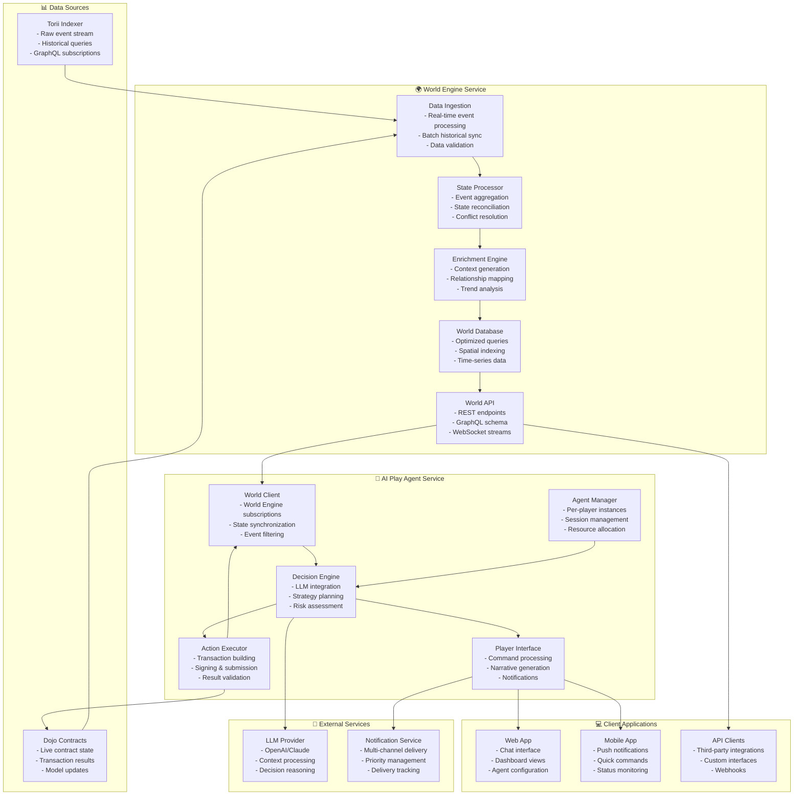
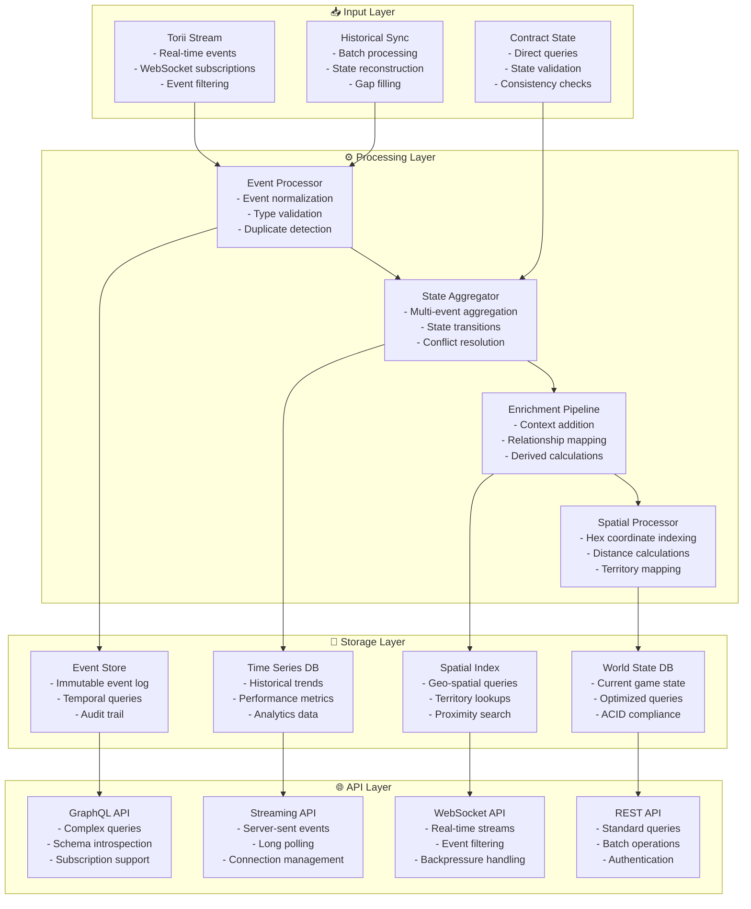
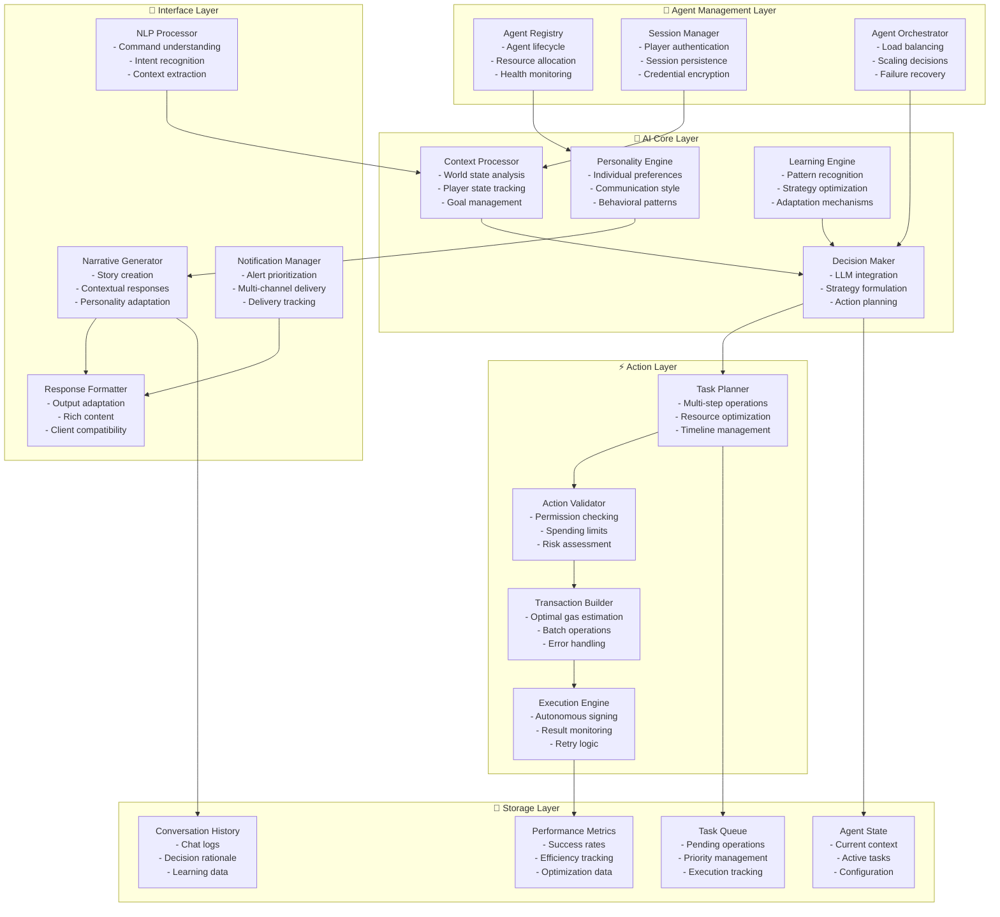
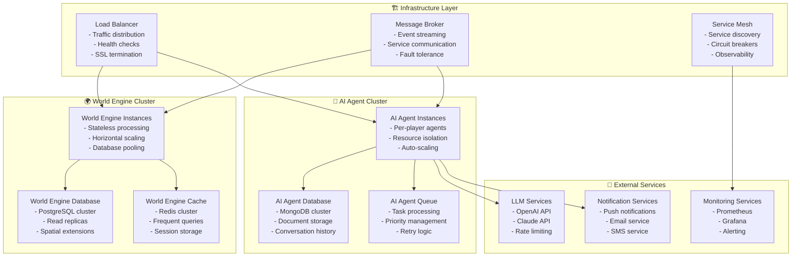

# AI Service Architecture: Modular MMO Infrastructure

## Overview

This document outlines the modular service architecture for the Infinite Hex Adventurers MMO, designed around AI-first interfaces and autonomous gameplay. The architecture splits functionality into two core services:

1. **World Engine Service**: Processes raw blockchain data and provides enriched world state
2. **AI Play Agent Service**: Manages individual AI agents that play on behalf of players

## High-Level Architecture



## Service 1: World Engine

### Purpose

The World Engine acts as the **single source of truth** for all game world data, processing raw blockchain events into enriched, queryable world state.

### Architecture



### World Engine API Specification

```typescript
// World Engine REST API
interface WorldEngineAPI {
  // Global World State
  getWorldOverview(): Promise<WorldOverview>;
  getGlobalEconomics(): Promise<EconomicState>;
  getActivePlayerCount(): Promise<number>;

  // Spatial Queries
  getHexDetails(coordinate: HexCoordinate): Promise<HexDetails>;
  getHexesInRadius(
    center: HexCoordinate,
    radius: number
  ): Promise<HexDetails[]>;
  getTerritoryByOwner(adventurerId: AdventurerId): Promise<Territory[]>;

  // Player-Specific Data
  getPlayerState(adventurerId: AdventurerId): Promise<PlayerState>;
  getPlayerDiscoveries(adventurerId: AdventurerId): Promise<Discovery[]>;
  getPlayerEconomics(adventurerId: AdventurerId): Promise<PlayerEconomics>;

  // Market & Economic Data
  getEnergyMarket(): Promise<EnergyMarketData>;
  getResourcePrices(): Promise<ResourcePrices>;
  getTradingOpportunities(): Promise<TradingOpportunity[]>;

  // Analytics & Trends
  getHexDiscoveryTrends(): Promise<TrendData>;
  getPlayerActivityHeatmap(): Promise<ActivityHeatmap>;
  getTerritorialExpansionRate(): Promise<ExpansionData>;
}

// World Engine WebSocket Events
interface WorldEngineEvents {
  hex_discovered: { hex: HexCoordinate; discoverer: AdventurerId };
  territory_claimed: { territory: Territory; owner: AdventurerId };
  player_moved: {
    player: AdventurerId;
    from: HexCoordinate;
    to: HexCoordinate;
  };
  energy_transferred: { from: AdventurerId; to: AdventurerId; amount: number };
  market_shift: {
    resource: ResourceType;
    old_price: number;
    new_price: number;
  };
  global_event: { type: string; data: any };
}
```

### World Engine Data Models

```typescript
interface WorldOverview {
  totalHexesDiscovered: number;
  totalTerritoriesClaimed: number;
  activePlayers: number;
  globalEnergyCirculation: number;
  recentDiscoveries: Discovery[];
  marketSummary: MarketSummary;
}

interface HexDetails {
  coordinate: HexCoordinate;
  biome: BiomeType;
  isDiscovered: boolean;
  discoverer?: AdventurerId;
  discoveryTime?: number;
  areas: AreaDetails[];
  resourceQuality: ResourceQuality;
  proximityMetrics: ProximityMetrics;
}

interface PlayerState {
  adventurerId: AdventurerId;
  owner: string;
  position: HexCoordinate;
  energy: EnergyState;
  traits: TraitState;
  territories: Territory[];
  discoveries: Discovery[];
  recentActivity: Activity[];
}
```

## Service 2: AI Play Agent

### Purpose

The AI Play Agent Service manages individual AI agents that act on behalf of players, making autonomous decisions based on World Engine data.

### Architecture



### AI Play Agent API Specification

```typescript
// AI Play Agent REST API
interface AIPlayAgentAPI {
  // Agent Management
  createAgent(playerAddress: string, config: AgentConfig): Promise<Agent>;
  getAgent(agentId: string): Promise<Agent>;
  updateAgentConfig(
    agentId: string,
    config: Partial<AgentConfig>
  ): Promise<void>;

  // Command Interface
  sendCommand(
    agentId: string,
    command: NaturalLanguageCommand
  ): Promise<CommandResponse>;
  getCommandHistory(agentId: string): Promise<CommandHistory>;

  // Automation Management
  configureAutomation(
    agentId: string,
    automation: AutomationRule
  ): Promise<void>;
  getActiveAutomations(agentId: string): Promise<AutomationRule[]>;
  pauseAutomation(agentId: string, automationId: string): Promise<void>;

  // Task Management
  getActiveTasks(agentId: string): Promise<Task[]>;
  cancelTask(agentId: string, taskId: string): Promise<void>;

  // Analytics
  getAgentPerformance(agentId: string): Promise<PerformanceMetrics>;
  getDecisionHistory(agentId: string): Promise<DecisionLog[]>;
}

// AI Play Agent WebSocket Events
interface AIPlayAgentEvents {
  agent_action: { agent: string; action: string; result: any };
  narrative_update: { agent: string; narrative: string; context: any };
  automation_triggered: { agent: string; automation: string; trigger: any };
  task_completed: { agent: string; task: string; success: boolean };
  opportunity_detected: { agent: string; opportunity: any };
  alert: { agent: string; alert: Alert };
}
```

### AI Agent Configuration

```typescript
interface AgentConfig {
  playerAddress: string;
  personality: PersonalityProfile;
  permissions: PermissionSet;
  automationRules: AutomationRule[];
  communicationPreferences: CommunicationPrefs;
}

interface PersonalityProfile {
  communicationStyle: "formal" | "casual" | "poetic" | "tactical";
  riskTolerance: "conservative" | "moderate" | "aggressive";
  interests: ("exploration" | "economics" | "social" | "strategy")[];
  relationshipLevel: "new" | "familiar" | "trusted" | "mentor";
  preferredDetailLevel: "minimal" | "standard" | "comprehensive";
}

interface PermissionSet {
  maxEnergyPerAction: number;
  maxActionsPerHour: number;
  allowedActions: string[];
  automationEnabled: boolean;
  spendingLimits: SpendingLimits;
}

interface AutomationRule {
  name: string;
  enabled: boolean;
  conditions: TriggerCondition[];
  actions: AutomatedAction[];
  priority: number;
}
```

## Service Integration Patterns

### World Engine → AI Play Agent Integration

```typescript
// AI Play Agent subscribes to World Engine events
class WorldEngineClient {
  private worldEngine: WorldEngineAPI;
  private eventStream: WebSocket;

  constructor(worldEngineUrl: string) {
    this.worldEngine = new WorldEngineAPI(worldEngineUrl);
    this.eventStream = new WebSocket(`${worldEngineUrl}/events`);
  }

  // Subscribe to world events relevant to a specific player
  subscribeToPlayerEvents(adventurerId: AdventurerId): Observable<WorldEvent> {
    return this.eventStream.pipe(
      filter((event) => this.isRelevantToPlayer(event, adventurerId)),
      map((event) => this.enrichEventContext(event))
    );
  }

  // Get enriched world state for agent decision making
  async getEnrichedWorldState(
    adventurerId: AdventurerId
  ): Promise<EnrichedWorldState> {
    const [playerState, surroundingHexes, marketData] = await Promise.all([
      this.worldEngine.getPlayerState(adventurerId),
      this.worldEngine.getHexesInRadius(playerState.position, 5),
      this.worldEngine.getEnergyMarket(),
    ]);

    return {
      playerState,
      surroundingHexes,
      marketData,
      opportunities: this.identifyOpportunities(
        playerState,
        surroundingHexes,
        marketData
      ),
    };
  }
}
```

### AI Play Agent → World Engine Feedback

```typescript
// AI Play Agent provides feedback to World Engine for analytics
class AgentAnalyticsReporter {
  private worldEngine: WorldEngineAPI;

  async reportAgentDecision(decision: AgentDecision): Promise<void> {
    await this.worldEngine.recordAgentActivity({
      adventurerId: decision.adventurerId,
      decisionType: decision.type,
      reasoning: decision.reasoning,
      outcome: decision.outcome,
      timestamp: Date.now(),
    });
  }

  async reportPlayerBehaviorPattern(pattern: BehaviorPattern): Promise<void> {
    await this.worldEngine.updatePlayerProfile({
      adventurerId: pattern.adventurerId,
      playstyle: pattern.playstyle,
      preferences: pattern.preferences,
      riskProfile: pattern.riskProfile,
    });
  }
}
```

## Authentication & Session Management

### Account Authentication Flow

```typescript
// Account Authentication
POST /auth/connect
{
  "account_address": "0x123...",
  "signature": "0xabc...",
  "message": "Connect AI Agent for account 0x123...",
  "permissions": {
    "max_energy_per_action": 1000,
    "max_actions_per_hour": 50,
    "allowed_actions": ["move", "explore", "trade", "maintain"],
    "automation_enabled": true,
    "notification_preferences": ["high_priority", "opportunities"]
  }
}

Response:
{
  "session_token": "jwt_token_here",
  "agent_id": "agent_uuid",
  "expires_at": "2024-01-01T00:00:00Z",
  "capabilities": {
    "autonomous_trading": true,
    "territory_management": true,
    "exploration_automation": true
  }
}
```

### Session Security

```typescript
interface SessionSecurity {
  sessionVault: {
    encryptedCredentials: string;
    hardwareSecurityModule: boolean;
    keyRotationSchedule: number;
  };

  transactionSigning: {
    autonomousSigningEnabled: boolean;
    spendingLimits: SpendingLimits;
    actionApprovalRequired: boolean;
  };

  securityPolicy: {
    actionAuthorization: AuthorizationLevel[];
    fraudDetection: FraudDetectionRules;
    auditLogging: AuditConfig;
  };
}
```

## Autonomous Operation Examples

### Tactical Automation: Territory Expansion

```typescript
// Complex Multi-Step Operation
{
  "operation": "expand_territory",
  "goal": "Secure 3 new hexes in the northern ice region",
  "constraints": {
    "max_energy": 800,
    "max_time": "2 hours",
    "risk_tolerance": "medium"
  },
  "execution_plan": [
    {
      "phase": "reconnaissance",
      "actions": [
        "scout_available_hexes",
        "analyze_competition",
        "assess_resource_quality"
      ]
    },
    {
      "phase": "positioning",
      "actions": [
        "move_to_optimal_location",
        "establish_supply_lines",
        "prepare_energy_reserves"
      ]
    },
    {
      "phase": "expansion",
      "actions": [
        "claim_primary_hex",
        "explore_adjacent_areas",
        "establish_territorial_control"
      ]
    }
  ],
  "adaptive_responses": {
    "competition_detected": "fallback_to_secondary_targets",
    "energy_shortage": "pause_and_recharge",
    "unexpected_opportunity": "evaluate_and_pivot"
  }
}
```

### Economic Automation: Energy Trading

```typescript
// Sophisticated Market Operations
{
  "operation": "energy_arbitrage",
  "strategy": "bulk_trading_with_market_timing",
  "parameters": {
    "energy_allocation": 2000,
    "target_profit": 0.15,
    "max_exposure": 0.3,
    "time_horizon": "24 hours"
  },
  "ai_behaviors": {
    "market_analysis": {
      "track_price_movements": true,
      "identify_trading_patterns": true,
      "predict_demand_spikes": true
    },
    "execution_strategy": {
      "split_large_orders": true,
      "timing_optimization": true,
      "slippage_minimization": true
    },
    "risk_management": {
      "stop_loss_threshold": 0.05,
      "position_sizing": "dynamic",
      "correlation_analysis": true
    }
  }
}
```

## Natural Language Interface

### Command Processing

```typescript
// Natural Language Commands
POST /command
{
  "account_address": "0x123...",
  "command": "I want to expand my territory northward",
  "urgency": "normal", // low, normal, high, immediate
  "auto_execute": true,
  "budget": {
    "max_energy": 500,
    "max_time": "1 hour"
  }
}

Response:
{
  "task_id": "task_uuid",
  "plan": {
    "steps": [
      {
        "action": "scout_northern_hexes",
        "estimated_cost": 45,
        "estimated_time": "5 minutes"
      },
      {
        "action": "move_to_optimal_hex",
        "estimated_cost": 120,
        "estimated_time": "2 minutes"
      },
      {
        "action": "explore_and_claim",
        "estimated_cost": 200,
        "estimated_time": "10 minutes"
      }
    ],
    "total_cost": 365,
    "success_probability": 0.85
  },
  "narrative": "I've identified three promising northern hexes...",
  "status": "planning" // planning, executing, completed, failed
}
```

### Narrative Generation

```typescript
// Example AI-Generated Narratives
class NarrativeExamples {
  explorationNarrative = `
    "As you step into the crystalline hex, your breath forms clouds in the 
    frigid air. Your Endurance training serves you well here. I detect 
    three unexplored areas ahead: an ice cave system, a frozen lake, and 
    what appears to be ancient ruins partially buried in snow."
  `;

  economicNarrative = `
    "The energy markets are buzzing today. Your 450 energy reserves could 
    fetch premium rates - I'm seeing 15% above standard conversion rates 
    for bulk transfers. Adventurer_9876 just posted a request for 200 
    energy to fund a massive excavation project."
  `;

  territorialNarrative = `
    "Your swampland territory is showing signs of decay. The energy 
    investment you made two weeks ago is wearing thin. However, the rare 
    mushrooms you cultivated have matured beautifully - their sale could 
    fund maintenance for another month."
  `;
}
```

## Deployment Architecture



## Example User Flow

### 1. Agent Creation & World Synchronization

```typescript
// Player creates an AI agent
const agentConfig = {
  playerAddress: "0x123...",
  personality: "aggressive_explorer",
  riskTolerance: "medium",
  goals: ["expand_territory", "maximize_energy"],
  automationLevel: "high",
};

// AI Play Agent Service creates agent
const agent = await aiPlayAgentAPI.createAgent(agentConfig);

// Agent subscribes to World Engine for player-specific events
const worldClient = new WorldEngineClient(agent.playerId);
const worldEvents = worldClient.subscribeToPlayerEvents(agent.adventurerId);

// Agent gets initial world state
const worldState = await worldClient.getEnrichedWorldState(agent.adventurerId);
```

### 2. Real-time Event Processing

```typescript
// World Engine processes Torii event
const toriiEvent = {
  type: "HexDiscovered",
  data: {
    hex: "0x1a2b3c...",
    discoverer: "adventurer_456",
    biome: "ice_cavern",
    timestamp: 1234567890,
  },
};

// World Engine enriches the event
const enrichedEvent = await worldEngine.enrichEvent(toriiEvent);

// World Engine broadcasts to interested AI agents
messagebroker.publish("world_events", enrichedEvent);

// AI Play Agent receives and processes event
aiAgent.processWorldEvent(enrichedEvent);
```

### 3. Autonomous Decision Making

```typescript
// AI Agent detects opportunity
const opportunity = {
  type: "territory_expansion",
  target: "0x1a2b3c...",
  estimatedCost: 350,
  successProbability: 0.85,
  reasoning: "Adjacent to owned territory, rich resource potential",
};

// Agent makes autonomous decision
const decision = await aiAgent.makeDecision(opportunity);

if (decision.approved) {
  // Execute multi-step plan
  const plan = await aiAgent.createExecutionPlan(decision);
  await aiAgent.executePlan(plan);

  // Notify player
  await aiAgent.notifyPlayer({
    type: "autonomous_action",
    action: "territory_expansion",
    result: plan.result,
    narrative: "I've successfully claimed the ice cavern territory...",
  });
}
```

### 4. Player Interaction

```typescript
// Player sends natural language command
const command = {
  agentId: "agent_123",
  text: "I want to focus on energy trading for the next few hours",
  urgency: "normal",
};

// AI Play Agent processes command
const response = await aiPlayAgentAPI.sendCommand(command);

// Response includes:
// - Updated strategy
// - Narrative explanation
// - Estimated outcomes
// - Automation adjustments
```

## Key Benefits

### 1. Separation of Concerns

- **World Engine**: Focuses purely on data processing and world state management
- **AI Play Agent**: Focuses on player-specific AI logic and automation

### 2. Scalability

- **World Engine**: Can handle thousands of concurrent data streams
- **AI Play Agent**: Can scale individual agent instances based on player demand

### 3. Modularity

- Services can be developed, deployed, and scaled independently
- Clear API boundaries enable different teams to work on different services
- Easy to add new services (e.g., Social Engine, Market Engine)

### 4. Reliability

- Service failures are isolated
- Each service can have its own redundancy and failover strategies
- Message queues ensure event delivery even during service outages

### 5. Flexibility

- Different AI models can be used for different agent types
- World Engine can serve multiple types of clients (agents, dashboards, analytics)
- Easy to experiment with new AI approaches without affecting world data

## Implementation Roadmap

### Phase 1: Foundation (Weeks 1-4)

- Set up basic World Engine with Torii integration
- Implement core data models and API endpoints
- Create simple AI Play Agent with basic decision making

### Phase 2: Intelligence (Weeks 5-8)

- Enhance World Engine with spatial indexing and analytics
- Integrate LLM providers for natural language processing
- Implement autonomous task execution

### Phase 3: Automation (Weeks 9-12)

- Add complex automation rules and triggers
- Implement multi-step operation planning
- Create adaptive learning mechanisms

### Phase 4: Scale & Polish (Weeks 13-16)

- Deploy production infrastructure
- Implement monitoring and observability
- Add advanced AI capabilities and social features

This modular architecture creates a robust foundation for an AI-driven MMO where players can truly delegate complex gameplay to intelligent agents while maintaining full control over their strategic direction.
