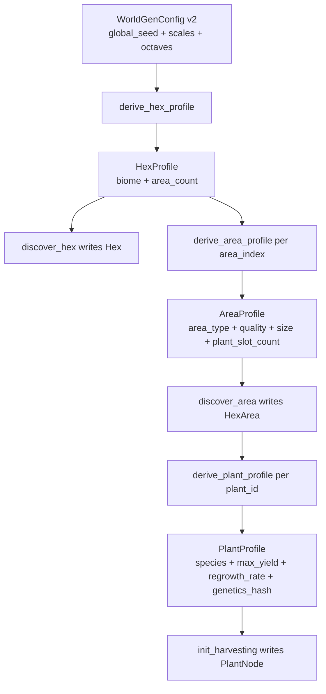
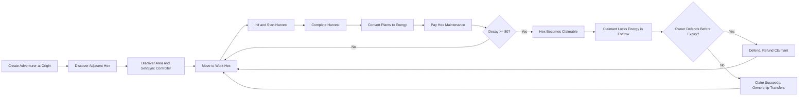
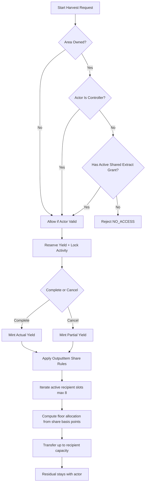

# Infinite Hex Adventurers

## FRACTALES

```text
███████╗██████╗  █████╗  ██████╗████████╗ █████╗ ██╗     ███████╗███████╗
██╔════╝██╔══██╗██╔══██╗██╔════╝╚══██╔══╝██╔══██╗██║     ██╔════╝██╔════╝
█████╗  ██████╔╝███████║██║        ██║   ███████║██║     █████╗  ███████╗
██╔══╝  ██╔══██╗██╔══██║██║        ██║   ██╔══██║██║     ██╔══╝  ╚════██║
██║     ██║  ██║██║  ██║╚██████╗   ██║   ██║  ██║███████╗███████╗███████║
╚═╝     ╚═╝  ╚═╝╚═╝  ╚═╝ ╚═════╝   ╚═╝   ╚═╝  ╚═╝╚══════╝╚══════╝╚══════╝
```

Infinite Hex Adventurers is a headless, on-chain game set in an infinite deterministic hex world where discovery drives ownership and economy.

## Generative World (v2)

Deterministic generation is config-driven (`WorldGenConfig`, active version `2`) and lazy-materialized:
- `discover_hex` derives biome + area count.
- `discover_area` derives area type/quality/size + `plant_slot_count`.
- `init_harvesting` derives species/max yield/regrowth/genetics.
- `plant_id` is bounded by discovered area slots: `0 <= plant_id < plant_slot_count`.
- Runtime is v2-only for harvesting init bounds: areas must have persisted `plant_slot_count` data; legacy zero-slot rows are rejected.

Core implementation files:
- `game/src/libs/world_gen.cairo`
- `game/src/libs/world_rng.cairo`
- `game/src/libs/biome_profiles.cairo`
- `game/src/systems/world_manager_contract.cairo`
- `game/src/systems/harvesting_manager_contract.cairo`



## MVP Game Loop



Loop notes:
- Movement and discovery are adjacency-gated.
- Harvesting uses reservation semantics to prevent over-commit.
- Decay/claim uses escrow with explicit timeout + refund.
- Permadeath is irreversible and blocks all state-changing actions.

## Economic Autoregulator (How It Fits)

The autoregulator is the control loop that sits between gameplay activity and policy knobs:

1. Players generate economic activity through harvesting, conversion, upkeep, and claims.
2. Epoch accounting snapshots sources/sinks and progression metrics.
3. Anyone can call permissionless `tick_autoregulator` once per epoch.
4. The tick updates policy for the next epoch and pays a clipped keeper bounty from the bounty pool.
5. Economic systems read the live policy:
   - `EconomicManager` applies conversion tax and upkeep multipliers.
   - `AdventurerManager` reads mint discount (`quote_create_adventurer_cost`).
6. Policy is next-epoch gated (`policy_epoch < current_epoch`) to avoid same-epoch feedback jitter.

Core files:
- `game/src/systems/autoregulator_manager.cairo`
- `game/src/systems/autoregulator_manager_contract.cairo`
- `game/src/models/economics.cairo`
- `game/src/systems/economic_manager_contract.cairo`
- `game/src/systems/adventurer_manager_contract.cairo`
- `docs/04-economy/autoregulator-prd-tdd.md`

### Smoke Test

Run sequentially (avoid parallel `snforge` in this repo):

```bash
cd game
snforge test autoregulator_manager
snforge test autoregulator_keeper_bounty
snforge test economic_manager_integration_policy_changes_apply_next_epoch
snforge test adventurer_manager_integration_mint_discount_reads_regulator_policy
cd ..
python3 -m unittest game.sim.tests.test_bootstrap_world_sim
python3 game/sim/bootstrap_world_sim.py --mode code_exact --out-dir /tmp/bootstrap-world-smoke
```

## Shared Harvest Flow (R5)



R5 behavior notes:
- Shared harvest ACL is enforced for owned areas (`controller` or granted `extract`).
- Output split routing runs on both complete and cancel paths.
- Distribution is deterministic floor math; capped recipients and recipient capacity are handled conservatively.

### Emergent Behavior (Why this is interesting)

- Labor markets can form naturally: controllers can lease `extract` access and pay workers via static output shares.
- Specialized logistics roles appear: recipients with spare inventory capacity become valuable because capacity limits can redirect residuals.
- Negotiation pressure is continuous: deterministic floor allocation means small `bp` changes produce predictable, testable payout shifts.
- Risk-sharing contracts are possible: because cancel and complete both route through split logic, collaborators can agree on downside splits, not just upside.
- Soft power over throughput emerges: controllers choose who receives guaranteed slices first, shaping local production networks without any offchain arbiter.
- Adversarial play stays bounded: cartel or rent-seeking behavior is allowed by design, but cannot violate conservation (`sum(allocations) <= gross`) or bypass ACL.
- Ownership politics matter: on transfer, stale grants/shares are invalidated by epoch, so each new controller can reset collaboration topology.

## MVP Scope Snapshot

- Canonical MVP source of truth: `docs/02-spec/mvp-functional-spec.md` and `docs/02-spec/design-decisions.md`.
- Canonical biome roster: 20 playable biomes.
- Major systems: `WorldManager`, `AdventurerManager`, `HarvestingManager`, `EconomicManager`, `OwnershipManager`.
- Out of MVP scope: mining, crafting, buildings, AI services, advanced hooks, full ERC-721 ownership contract.

## Docs

Start here:
- `docs/MASTER_DOC.md`

Authoritative implementation spec:
- `docs/02-spec/mvp-functional-spec.md`

Latest live Slot release + player runbook:
- `docs/07-delivery/releases/2026-02-13-gen-dungeon-live-20260213b.md`

## Current Live Slot Deployment

As of `2026-02-13`, the current live Slot deployment is:

- Slot project: `gen-dungeon-live-20260213b`
- Katana RPC: `https://api.cartridge.gg/x/gen-dungeon-live-20260213b/katana`
- Torii HTTP: `https://api.cartridge.gg/x/gen-dungeon-live-20260213b/torii`
- Torii GraphQL: `https://api.cartridge.gg/x/gen-dungeon-live-20260213b/torii/graphql`
- World address: `0x00f3d3b78a41b212442a64218a7f7dbde331813ea09a07067c7ad12f93620c11`

Runbook + player instructions:
- `docs/07-delivery/releases/2026-02-13-gen-dungeon-live-20260213b.md`
