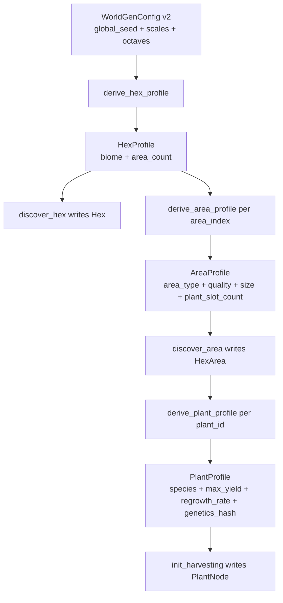
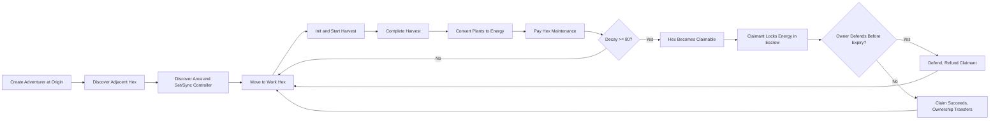

# Infinite Hex Adventurers

## FRACTALES

```text
███████╗██████╗  █████╗  ██████╗████████╗ █████╗ ██╗     ███████╗███████╗
██╔════╝██╔══██╗██╔══██╗██╔════╝╚══██╔══╝██╔══██╗██║     ██╔════╝██╔════╝
█████╗  ██████╔╝███████║██║        ██║   ███████║██║     █████╗  ███████╗
██╔══╝  ██╔══██╗██╔══██║██║        ██║   ██╔══██║██║     ██╔══╝  ╚════██║
██║     ██║  ██║██║  ██║╚██████╗   ██║   ██║  ██║███████╗███████╗███████║
╚═╝     ╚═╝  ╚═╝╚═╝  ╚═╝ ╚═════╝   ╚═╝   ╚═╝  ╚═╝╚══════╝╚══════╝╚══════╝
```

Infinite Hex Adventurers is a headless, on-chain game set in an infinite deterministic hex world where discovery drives ownership and economy.

## Generative World (v2)

Deterministic generation is config-driven (`WorldGenConfig`, active version `2`) and lazy-materialized:
- `discover_hex` derives biome + area count.
- `discover_area` derives area type/quality/size + `plant_slot_count`.
- `init_harvesting` derives species/max yield/regrowth/genetics.
- `plant_id` is bounded by discovered area slots: `0 <= plant_id < plant_slot_count`.
- Runtime is v2-only for harvesting init bounds: areas must have persisted `plant_slot_count` data; legacy zero-slot rows are rejected.

Core implementation files:
- `game/src/libs/world_gen.cairo`
- `game/src/libs/world_rng.cairo`
- `game/src/libs/biome_profiles.cairo`
- `game/src/systems/world_manager_contract.cairo`
- `game/src/systems/harvesting_manager_contract.cairo`



## MVP Game Loop



Loop notes:
- Movement and discovery are adjacency-gated.
- Harvesting uses reservation semantics to prevent over-commit.
- Decay/claim uses escrow with explicit timeout + refund.
- Permadeath is irreversible and blocks all state-changing actions.

## MVP Scope Snapshot

- Canonical MVP source of truth: `docs/02-spec/mvp-functional-spec.md` and `docs/02-spec/design-decisions.md`.
- Canonical biome roster: 20 playable biomes.
- Major systems: `WorldManager`, `AdventurerManager`, `HarvestingManager`, `EconomicManager`, `OwnershipManager`.
- Out of MVP scope: mining, crafting, buildings, AI services, advanced hooks, full ERC-721 ownership contract.

## Docs

Start here:
- `docs/MASTER_DOC.md`

Authoritative implementation spec:
- `docs/02-spec/mvp-functional-spec.md`

Latest live Slot release + player runbook:
- `docs/07-delivery/releases/2026-02-13-gen-dungeon-live-20260213b.md`

## Current Live Slot Deployment

As of `2026-02-13`, the current live Slot deployment is:

- Slot project: `gen-dungeon-live-20260213b`
- Katana RPC: `https://api.cartridge.gg/x/gen-dungeon-live-20260213b/katana`
- Torii HTTP: `https://api.cartridge.gg/x/gen-dungeon-live-20260213b/torii`
- Torii GraphQL: `https://api.cartridge.gg/x/gen-dungeon-live-20260213b/torii/graphql`
- World address: `0x00f3d3b78a41b212442a64218a7f7dbde331813ea09a07067c7ad12f93620c11`

Runbook + player instructions:
- `docs/07-delivery/releases/2026-02-13-gen-dungeon-live-20260213b.md`
